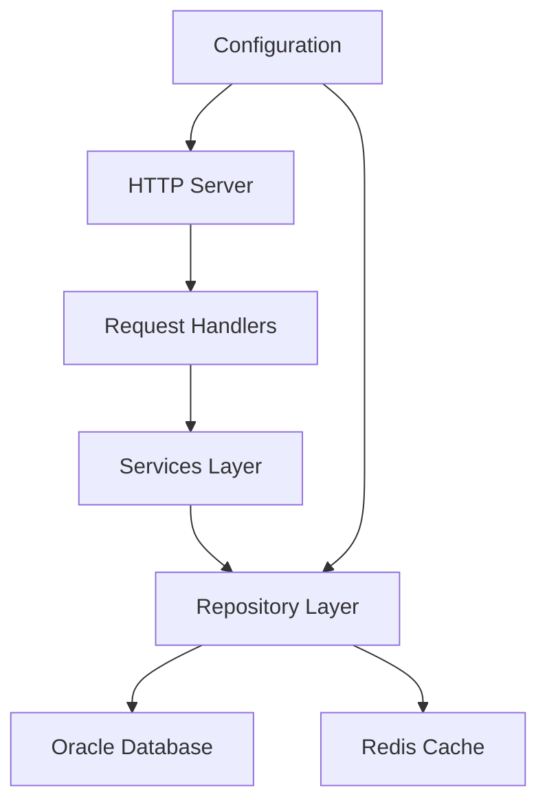

# Backend Documentation

## Architecture Overview



## Technology Stack

### Core Technologies
- **Language**: Rust (latest stable)
- **Web Framework**: Actix-web
- **Database**: Oracle
- **Cache**: Redis
- **Logging**: Tracing

### Key Dependencies
```toml
[dependencies]
actix-web = "4.4"      # Web framework
oracle = "0.5"         # Oracle database driver
redis = "0.23"         # Redis client
tracing = "0.1"        # Logging framework
dotenv = "0.15"        # Environment management
```

## Project Structure

```
src/
├── main.rs              # Application entry point
├── handlers/            # HTTP request handlers
│   └── nfe_identification_handler.rs
├── services/           # Business logic layer
│   └── nfe_identification_service.rs
├── repositories/       # Data access layer
│   └── nfe_identification_repository.rs
└── models/            # Data models
    └── nfe_identification.rs
```

## Core Components

### 1. Application Entry Point (main.rs)
- Server configuration
- Database connections
- Redis cache setup
- Route configuration
- Logging setup

### 2. Handlers Layer
- HTTP request processing
- Input validation
- Response formatting
- Error handling

### 3. Services Layer
- Business logic implementation
- Data transformation
- Cache management
- Transaction handling

### 4. Repository Layer
- Database operations
- Cache operations
- Connection management
- Query optimization

### 5. Models Layer
- Data structures
- Validation rules
- Serialization/deserialization
- Type safety

## Database Schema

### NFe Identification Table
```sql
CREATE TABLE nfe_identification (
    id NUMBER PRIMARY KEY,
    cuf NUMBER NOT NULL,
    cnf VARCHAR2(8) NOT NULL,
    natop VARCHAR2(60) NOT NULL,
    mod NUMBER NOT NULL,
    serie NUMBER NOT NULL,
    nnf NUMBER NOT NULL,
    dhemi TIMESTAMP NOT NULL,
    dhsaient TIMESTAMP,
    tp_nf NUMBER NOT NULL,
    id_dest NUMBER,
    id_emit NUMBER,
    id_tot NUMBER,
    created_at TIMESTAMP DEFAULT CURRENT_TIMESTAMP,
    updated_at TIMESTAMP DEFAULT CURRENT_TIMESTAMP
);
```

## API Endpoints

### NFe Identification API
```rust
// GET /api/identifications
async fn list_identifications(
    repo: web::Data<Arc<NFeIdentificationRepository>>,
    query: web::Query<QueryParams>
) -> impl Responder

// POST /api/identifications
async fn create_identification(
    repo: web::Data<Arc<NFeIdentificationRepository>>,
    identification: web::Json<NFeIdentification>
) -> impl Responder

// GET /api/identifications/{id}
async fn get_identification(
    repo: web::Data<Arc<NFeIdentificationRepository>>,
    id: web::Path<i32>
) -> impl Responder

// PUT /api/identifications/{id}
async fn update_identification(
    repo: web::Data<Arc<NFeIdentificationRepository>>,
    id: web::Path<i32>,
    identification: web::Json<NFeIdentification>
) -> impl Responder

// DELETE /api/identifications/{id}
async fn delete_identification(
    repo: web::Data<Arc<NFeIdentificationRepository>>,
    id: web::Path<i32>
) -> impl Responder
```

## Caching Strategy

### Redis Cache Implementation
- Key format: `nfe:{id}`
- TTL: 1 hour
- Cache invalidation on updates
- Cache warming on startup

### Cache Operations
```rust
// Cache key generation
fn cache_key(id: i32) -> String {
    format!("nfe:{}", id)
}

// Cache operations
async fn get_from_cache(&self, key: &str) -> Option<NFeIdentification>
async fn set_in_cache(&self, key: &str, value: &NFeIdentification) -> Result<()>
async fn delete_from_cache(&self, key: &str) -> Result<()>
```

## Error Handling

### Error Types
```rust
pub enum AppError {
    DatabaseError(oracle::Error),
    CacheError(redis::RedisError),
    ValidationError(String),
    NotFoundError(String),
    InternalError(String),
}
```

### Error Responses
```json
{
    "error": {
        "code": "ERROR_CODE",
        "message": "Error description",
        "details": {}
    }
}
```

## Logging

### Log Levels
- ERROR: Critical errors
- WARN: Warning conditions
- INFO: General information
- DEBUG: Detailed debugging information
- TRACE: Very detailed debugging information

### Log Format
```
[2024-04-03T12:34:56Z INFO  main] Starting HTTP server
[2024-04-03T12:34:57Z DEBUG handlers::nfe_identification] Processing request
```

## Performance Optimization

### Database Optimization
- Connection pooling
- Prepared statements
- Query optimization
- Index usage

### Cache Optimization
- Lazy loading
- Cache warming
- Cache invalidation
- Memory management

## Security

### Input Validation
- Data type validation
- Length validation
- Format validation
- Business rule validation

### Authentication & Authorization
- (To be implemented)
- JWT token validation
- Role-based access control
- API key management

## Monitoring

### Health Checks
- Database connectivity
- Redis connectivity
- Memory usage
- CPU usage

### Metrics
- Request latency
- Cache hit rate
- Database query performance
- Error rates

## Development Guidelines

### Code Style
- Follow Rust style guide
- Use clippy for linting
- Document all public APIs
- Write unit tests

### Testing
- Unit tests
- Integration tests
- Performance tests
- Load tests

### Deployment
- Docker containerization
- Kubernetes orchestration
- CI/CD pipeline
- Monitoring setup

## Troubleshooting

### Common Issues
1. Database Connection Issues
2. Cache Invalidation Problems
3. Performance Bottlenecks
4. Memory Leaks

### Debugging Tools
- Logging
- Profiling
- Tracing
- Monitoring

## Future Improvements

- [ ] Implement authentication
- [ ] Add rate limiting
- [ ] Implement WebSocket support
- [ ] Add GraphQL API
- [ ] Implement distributed tracing
- [ ] Add more comprehensive monitoring
- [ ] Implement automated backups
- [ ] Add data migration tools 