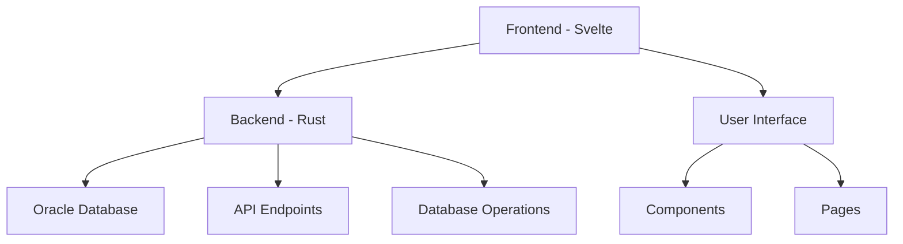
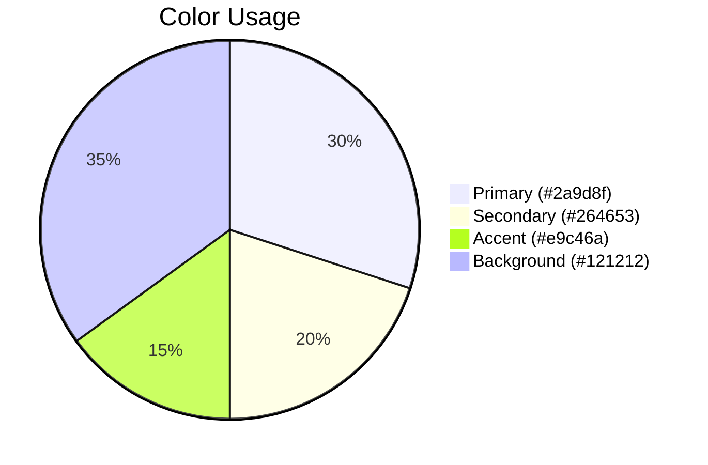

# NFe Management System

A full-stack application for managing NFe (Nota Fiscal Eletrônica) documents, built with Rust and Svelte.

## Architecture Overview



## Technology Stack

### Frontend
- **Framework**: Svelte 5
- **UI Components**: Carbon Design System
- **State Management**: Svelte Stores
- **Routing**: Svelte Routing
- **Build Tool**: Vite
- **Package Manager**: Bun

### Backend
- **Language**: Rust
- **Web Framework**: Actix-web
- **Database**: Oracle
- **ORM**: SQLx

## Project Structure

```
.
├── rust_oracle_react/          # Rust backend API
│   ├── src/
│   │   ├── main.rs            # Application entry point
│   │   ├── handlers/          # Request handlers
│   │   ├── models/            # Data models
│   │   ├── repositories/      # Database operations
│   │   └── services/          # Business logic
│   └── migrations/            # Database migrations
│
└── svelte-frontend/           # Svelte frontend application
    ├── src/
    │   ├── components/        # Reusable UI components
    │   ├── pages/            # Page components
    │   ├── services/         # API services
    │   ├── stores/           # State management
    │   ├── styles/           # Global styles
    │   └── types/            # TypeScript types
    └── public/               # Static assets
```

## Frontend Components

### Core Components
- **App.svelte**: Main application component
- **Header**: Navigation and menu
- **SideNav**: Sidebar navigation
- **DataTable**: Reusable data table component
- **Form**: Generic form component

### Pages
- **HomePage**: Dashboard view
- **IdePage**: NFe identification management
- **MetricsPage**: System metrics and monitoring
- **PlaceholderPage**: Template for future features

## Design System

### Color Palette


### Typography
- **Primary Font**: System UI
- **Heading Sizes**: 1.5rem - 2.5rem
- **Body Text**: 1rem
- **Small Text**: 0.875rem

## Setup Instructions

### Prerequisites
- Rust (latest stable version)
- Oracle Database
- Oracle Client (including SQL*Plus)
- Bun (package manager)
- Cargo (Rust package manager)

### Backend Setup
1. Configure environment variables:
```bash
cp .env.example .env
# Edit .env with your Oracle database credentials
```

2. Run database migrations:
```bash
./scripts/setup_db.sh
```

3. Start the backend server:
```bash
cargo run
```

### Frontend Setup
1. Install dependencies:
```bash
cd svelte-frontend
bun install
```

2. Start the development server:
```bash
bun run dev
```

## API Documentation

### NFe Identification Endpoints
- `GET /api/identifications` - List all NFe identifications
- `POST /api/identifications` - Create new NFe identification
- `GET /api/identifications/{id}` - Get specific NFe identification
- `PUT /api/identifications/{id}` - Update NFe identification
- `DELETE /api/identifications/{id}` - Delete NFe identification

### System Metrics Endpoints
- `GET /api/metrics` - Get system performance metrics
- `GET /api/metrics/database` - Get database performance metrics

## Development

### Running the Application
- Backend: `http://localhost:8080`
- Frontend: `http://localhost:5173`

### Development Tools
- **Linting**: ESLint
- **Type Checking**: TypeScript
- **Testing**: (To be implemented)
- **CI/CD**: (To be implemented)

## Contributing

1. Fork the repository
2. Create a feature branch
3. Commit your changes
4. Push to the branch
5. Create a Pull Request

## License

MIT License

## Screenshots

[Placeholder for application screenshots]

## Roadmap

- [ ] Implement user authentication
- [ ] Add advanced search functionality
- [ ] Implement data export features
- [ ] Add real-time notifications
- [ ] Implement comprehensive testing
- [ ] Add CI/CD pipeline 